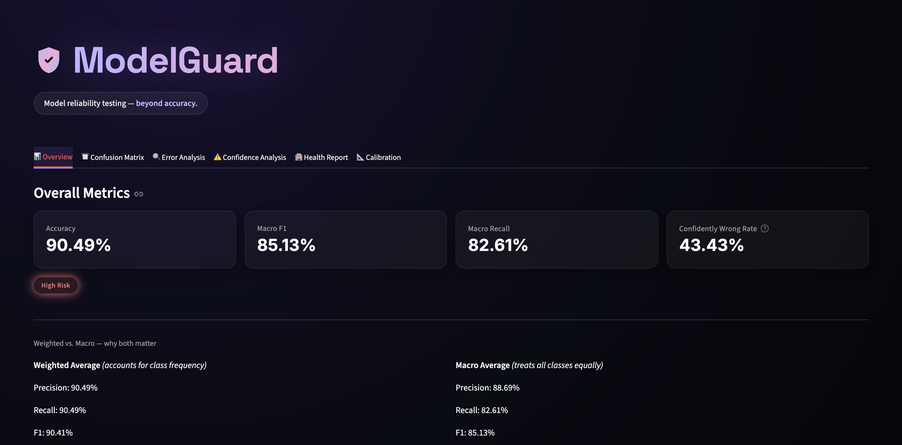
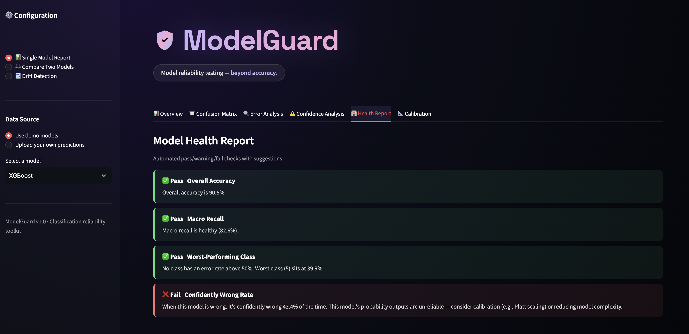
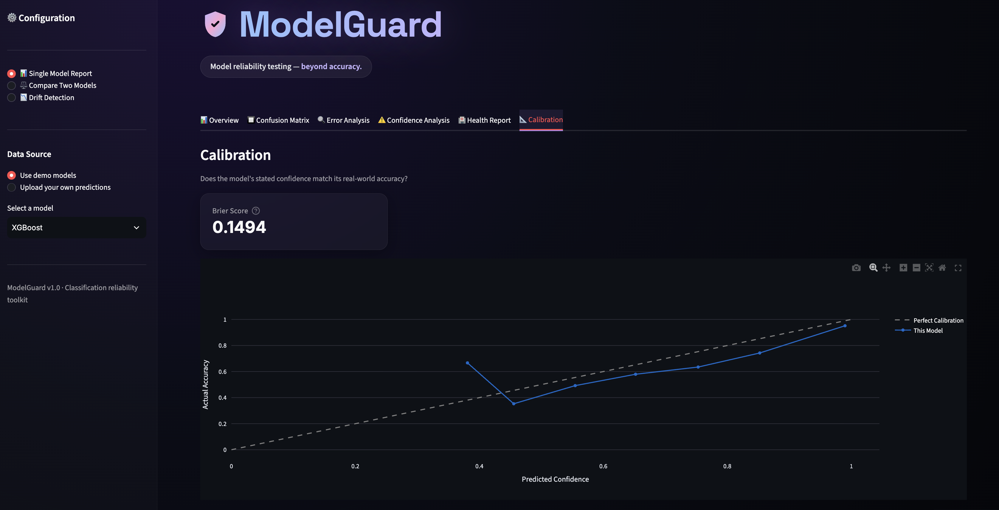

# 🛡️ ModelGuard

**Model reliability testing — beyond accuracy.**

Most ML projects stop at accuracy. ModelGuard goes further: it checks whether a classification model can actually be trusted — where it fails, whether it's confidently wrong, whether its probabilities are calibrated, and whether it holds up against alternative models or shifting data.

A model can report 92% accuracy and still be dangerously unreliable. ModelGuard finds out.

---

## 🔍 The core finding

Using this tool on three models trained on the same dataset (Forest Cover Type, 7 classes, 50k stratified samples):

| Model | Accuracy | Confidently Wrong Rate* |
|---|---|---|
| Logistic Regression | 72.8% | **2.5%** |
| Random Forest | 87.6% | 2.3% |
| XGBoost (tuned for depth) | **90.5%** | **43.4%** |

*% of the model's wrong predictions made with >90% stated confidence.

**XGBoost has the highest accuracy of the three — and is also, by far, the least trustworthy.** When it's wrong, it's confidently wrong nearly half the time. A reliability check built purely on accuracy would have picked the worst model. ModelGuard's Health Report catches this automatically: XGBoost fails the Confidently Wrong Rate check while passing every other check, including accuracy and macro recall.

The same pattern shows up in the reliability diagram: XGBoost's predicted confidence sits visibly above its actual accuracy across most confidence bins, while Logistic Regression tracks the diagonal (perfect calibration) closely. Interestingly, XGBoost's *Brier score* is numerically better than Logistic Regression's — a good illustration of why a single aggregate metric can mislead, and why ModelGuard surfaces both.

---

## ✨ Features

- **Model Evaluation** — accuracy, precision, recall, F1 (macro *and* weighted), confusion matrix, per-class report
- **Error Analysis** — misclassified examples, worst-performing classes, what each class is most often confused with
- **Confidence Analysis** — flags predictions that are wrong *and* high-confidence, with an adjustable threshold
- **Calibration** — reliability diagram and Brier score, with an explicit caveat on Brier score's limitations
- **Model Comparison** — side-by-side metrics for two models, with direction-aware "better model" detection (so a lower-is-better metric like Confidently Wrong Rate isn't misread)
- **Health Report** — automated ✅/⚠️/❌ checks across accuracy, recall, worst-class error rate, and confidently-wrong rate, with plain-English suggestions
- **Drift Detection** — Kolmogorov-Smirnov test across features between a reference and current dataset, flagging statistically significant distribution shifts

Every module works with either the built-in demo models or your own uploaded predictions (`y_true.csv`, `y_pred.csv`, `y_proba.csv`) — any number of classes, any dataset size.

---

## 🖥️ Screenshots

**Overview** — accuracy alone hides the real story


**Health Report** — XGBoost passes accuracy and recall, fails on trustworthiness


**Calibration** — the reliability diagram shows exactly where confidence diverges from reality


---

## 🧱 Tech Stack

Python · Pandas · NumPy · scikit-learn · XGBoost · SciPy · Plotly · Streamlit · pytest

---

## 🚀 Try it live

**[Live demo →](https://modelguard.streamlit.app)**

---

## 🛠️ Running locally

```bash
git clone https://github.com/aadeshbuilds/ModelGuard.git
cd ModelGuard
python3 -m venv venv
source venv/bin/activate
pip install -r requirements.txt
streamlit run app/streamlit_app.py
```

To use your own model's predictions instead of the demo models, upload three CSVs:
- `y_true.csv` — true labels, single column
- `y_pred.csv` — predicted labels, single column
- `y_proba.csv` — predicted probabilities, one column per class, **in ascending class order** (standard `predict_proba()` output)

---

## ✅ Testing

```bash
pip install -r requirements-dev.txt
pytest tests/
```

20 unit tests across all 7 core modules. Testing surfaced and fixed 5 real bugs during development, including silent `NaN` results for perfect-scoring classes/models and crashes on plain-list (non-array) input — the kind of edge cases that don't show up until someone uses the tool differently than you tested it yourself.

---

## 🗺️ Roadmap

- Configurable Health Report thresholds (currently fixed defaults, illustrative rather than domain-validated)
- Support for regression models (currently classification-only)
- Larger-scale drift monitoring (batching, streaming input)

---

## 📄 License

MIT — see [LICENSE](LICENSE).

---

Built by [Aadesh](https://github.com/aadeshbuilds) as a portfolio project exploring the gap between model accuracy and model trustworthiness.
